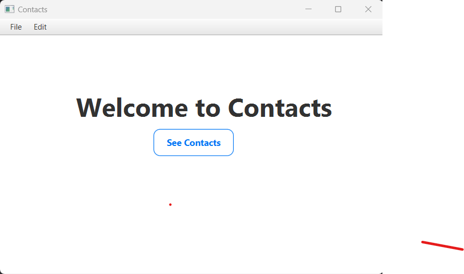
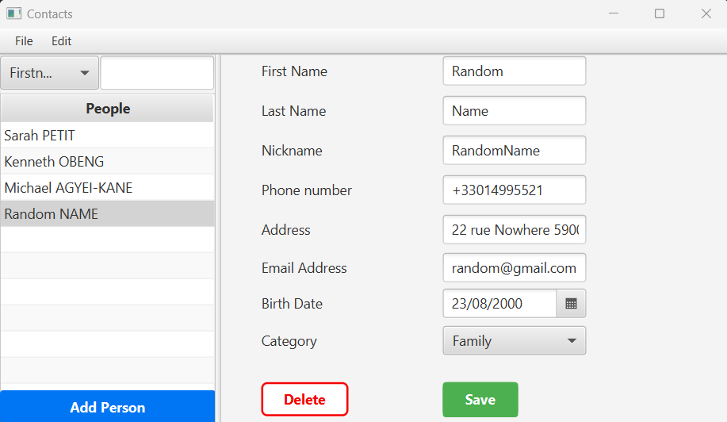
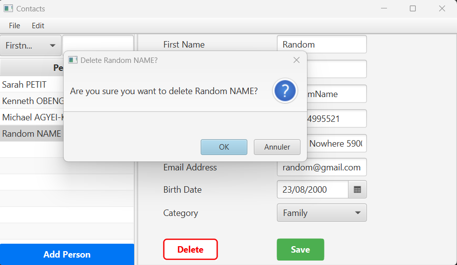
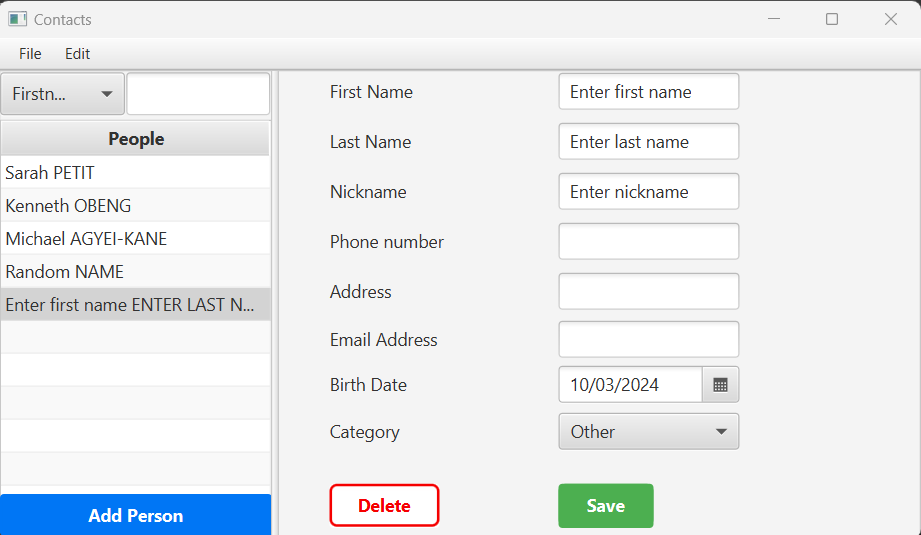
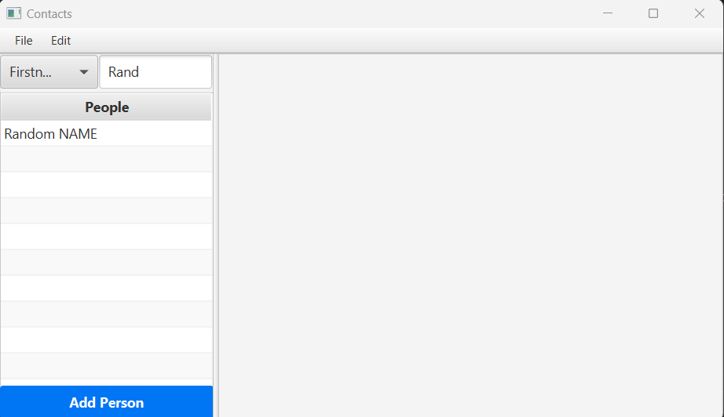
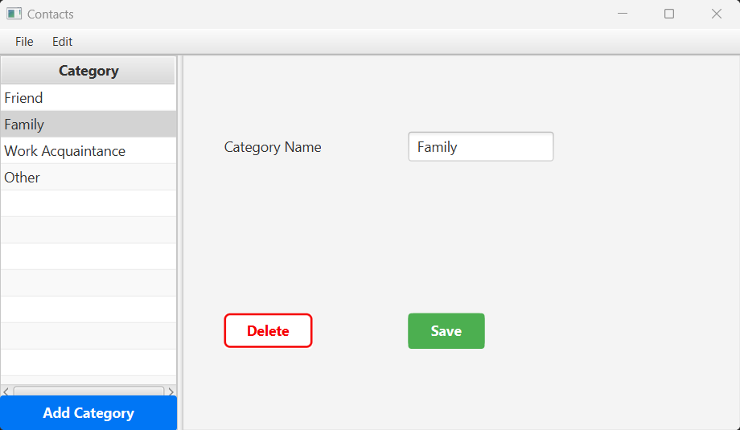
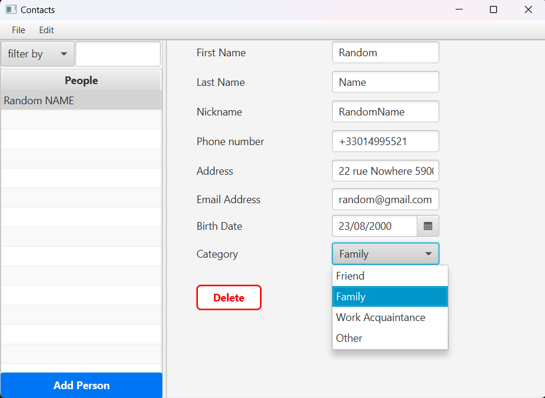

# Contacts
A Maven desktop app for managing your contacts.

# Home Screen

The Home Screen just contains a button to go to the page "Manage Persons".
We can also see the main menu at the top. It helps to close the App or navigate between the pages.

# Manage Persons

This is the page to manage persons : list all persons or filter them, update / add / delete persons.

On the left on that page, we have the list of all persons in the database and if we select a person we can see the details of that person on the right of the page.

We can then update the informations about the person selected or delete the person.
When we delete a person an alert appears to be sure that we want to delete the person.

In the left bottom corner we have a button to add a person like this :

In the top of the list of persons we can filter the list. For example we can filter all persons that have a firstname that contains "Rand" like this :

# Manage Categories

This page manages the categories. Each person is associated to a category : friend, family, work acquaintance, etc...
So here we can update, add or delete the categories (in the same way than persons).

The modifications in this page modify the options that we can put in the dropdown menu "Category" when we manage persons :

